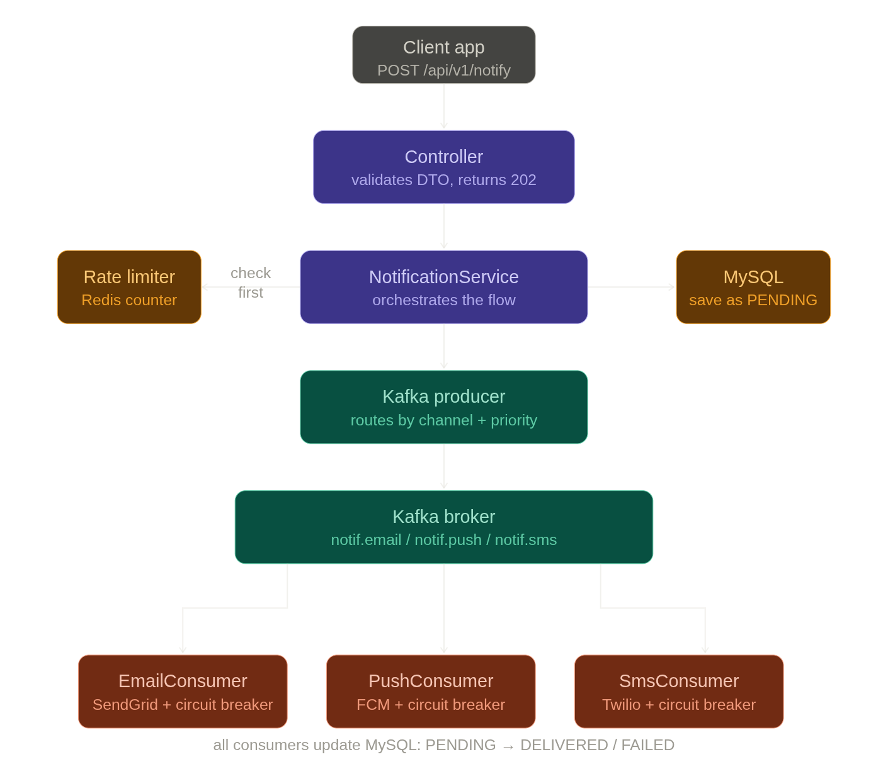
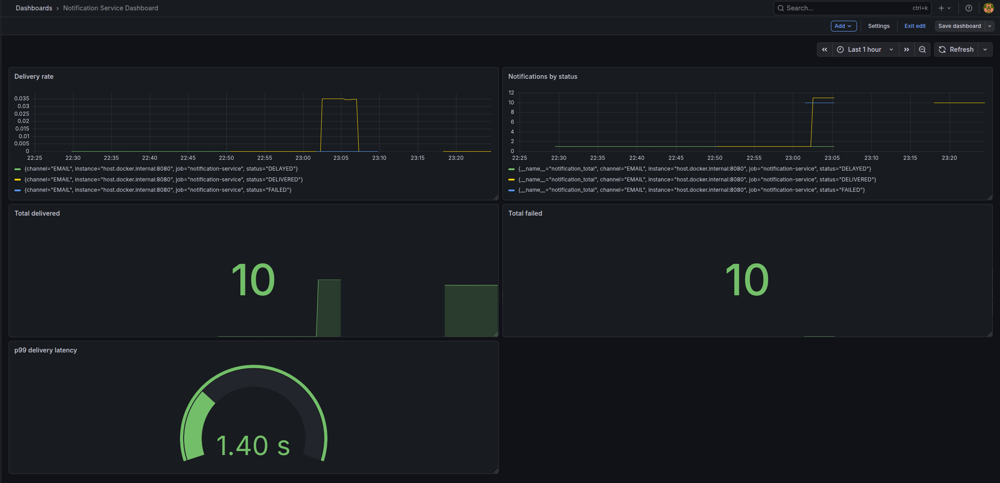

# Overview

The notification service helps send notifications to consumers based on different types of channels: email, push, or SMS, using a producer-consumer model supported by Kafka. The service rate-limits to 10 notifications per user per hour and has a priority feature which prioritizes sending critical messages backed by Kafka partitions.

# Architecture



# What's working
- POST /api/v1/notification/send → 202 Accepted, async delivery via Kafka
- Real email delivery via SendGrid
- Real SMS delivery via Twilio
- FCM push notifications (circuit breaker tested)
- Rate limiting — 10 notifications per user per hour via Redis
- Priority routing — CRITICAL → partition 0, PROMOTIONAL → partition 1
- Outbox pattern — guaranteed delivery even on app crash
- DND windows — notifications delayed and retried via Quartz
- Prometheus metrics at /actuator/prometheus
- 46 unit tests passing

# Technical Decisions
1. Kafka guarantees at-least-once delivery — consumers track offsets and resume from last committed position after a crash.
2. Redis for rate limiting — sub-millisecond counter increments with automatic key expiry after 1 hour.
3. Outbox pattern solves the dual write problem — notification and outbox rows are saved in the same DB transaction. A poller publishes outbox rows to Kafka and marks them PUBLISHED, ensuring no notification is lost if the app crashes between DB save and Kafka publish.
4. Priority routing via Kafka partitions — CRITICAL messages route to partition 0, PROMOTIONAL to partition 1, ensuring critical notifications are processed first.
5. Optimistic locking via @Version on Notification entity — prevents duplicate status updates when multiple consumer instances process the same message.
6. Resilience4j circuit breaker per provider — if SendGrid/FCM/Twilio starts failing, the circuit opens after 50% failure rate over 10 calls. Retries with exponential backoff (1s → 2s → 4s) before recording a failure.
7. Provider isolation — each channel has its own Kafka topic, consumer, and circuit breaker. An SMS provider outage doesn't affect email delivery.
8. DND windows with timezone-aware midnight-crossing check — notifications during quiet hours are marked DELAYED and retried via Quartz scheduler after the DND window ends.
9. Unit tests over integration tests — 46 unit tests using Mockito
   mock dependencies to test business logic in isolation. Fast,
   no infrastructure required. Testcontainers was evaluated for
   integration tests but requires Docker API 1.40+ — unit tests
   provide sufficient coverage for business logic validation.
10. GitHub Actions CI/CD — 4-stage pipeline on every push:
        secret scanning (TruffleHog), build, test, SonarCloud
        quality analysis. Pipeline fails fast — each stage only
        runs if the previous one passes.

# Tech Stack
1. Java 21
2. Spring Boot 3.2.3
3. Apache Kafka — async message streaming, 2 partitions per topic
4. Redis — sub-millisecond rate limiting, sliding window counter
5. MySQL 8 — persistent notification and outbox storage
6. Docker — local infrastructure (Kafka, Redis, MySQL, Zookeeper)
7. Resilience4j — circuit breaker + exponential backoff retry per provider
8. SendGrid — email delivery
9. Firebase FCM — push notifications
10. Twilio — SMS delivery

# Getting Started
1. Java 21, Maven and Docker installed
2. Create a SendGrid account and verify a sender email
3. Create a Firebase project and download service account JSON to `src/main/resources/firebase-service-account.json`
4. Create a Twilio account and verify your phone number
5. Copy `.env.example` to `.env` and fill in all values
6. Run `docker-compose up -d`
7. Wait 30 seconds then run `./mvnw spring-boot:run`

# Environment Variables
See `.env.example` for all required variables:
```
MYSQL_USER, MYSQL_PASSWORD, MYSQL_ROOT_PASSWORD
SENDGRID_API_KEY, SENDGRID_FROM_EMAIL
FIREBASE_CREDENTIALS_PATH
TWILIO_ACCOUNT_SID, TWILIO_AUTH_TOKEN, TWILIO_FROM_NUMBER
```

# API Reference

### Create user (POST)
`POST http://localhost:8080/api/v1/users`
```json
{
  "userId": "user123",
  "email": "user@gmail.com",
  "name": "Neelesh",
  "phone": "+91XXXXXXXXXX",
  "emailEnabled": true,
  "pushEnabled": true,
  "smsEnabled": true,
  "timezone": "Asia/Kolkata",
  "fcmToken": "device-fcm-token"
}
```
### Update user (PUT)
`PUT http://localhost:8080/api/v1/users/{userId}`
```json
{
  "userId": "user123",
  "email": "user@gmail.com",
  "name": "Neelesh",
  "phone": "+91XXXXXXXXXX",
  "emailEnabled": true,
  "pushEnabled": true,
  "smsEnabled": true,
  "timezone": "Asia/Kolkata",
  "fcmToken": "device-fcm-token"
}
```

### Send notification (POST)
`POST http://localhost:8080/api/v1/notification/send`
```json
{
  "userId": "user123",
  "channel": "EMAIL",
  "priority": "CRITICAL",
  "title": "Test",
  "body": "Hello from the notification service"
}
```
Response `202 Accepted`:
```json
{
  "status": "PENDING",
  "message": "Notification queued for delivery",
  "notificationId": 1
}
```

# Project Structure
```
config/     KafkaConfig.java, FirebaseConfig.java, TwilioConfig.java
enums/      Channel.java, Priority.java
model/      Notification.java, OutboxEvent.java, UserPreferences.java
dto/        NotificationRequest.java, NotificationEvent.java
repository/ NotificationRepository.java, OutboxRepository.java, UserPreferencesRepository.java
service/    NotificationService.java, RateLimiterService.java, 
            UserPreferencesService.java, OutboxPoller.java,
            DndService.java, DndSchedulerService.java
job/        RetryNotificationJob.java
kafka/      KafkaProducer.java, EmailConsumer.java, 
            PushConsumer.java, SmsConsumer.java
provider/   EmailSender.java, PushSender.java, SMSSender.java
controller/ NotificationController.java, UserPreferencesController.java
resources/  application.yml, docker-compose.yml
src/test/
  service/   DndServiceTest.java, RateLimiterServiceTest.java,
             NotificationServiceTest.java, UserPreferencesServiceTest.java
  controller/ NotificationControllerTest.java
```

# Performance
Load tested with JMeter — 50 concurrent users, 1000 total requests.

| Metric | Value |
|--------|-------|
| Throughput | 840 notifications/min |
| Average latency | 8ms |
| p99 delivery latency (SendGrid) | 1.40s |
| Error rate | 0% |

Note: latency measures API acceptance time (202 response).
Actual delivery is async via Kafka. Email delivery latency
via SendGrid averages ~1.6s measured via Prometheus metrics.

# Grafana Dashboard


# Test:
```
DndServiceTest              12 tests ✅
RateLimiterServiceTest      11 tests ✅
NotificationServiceTest      6 tests ✅
NotificationControllerTest   7 tests ✅
UserPreferencesServiceTest  10 tests ✅
Total                       46 tests ✅
```

# Known Limitations
- FCM requires a real Android/iOS device for actual push delivery — circuit breaker tested with invalid token
- Twilio trial account limited to verified numbers only

# Upcoming
- Grafana dashboard for Prometheus metrics visualisation

# Development Notes
This project was built with AI-assisted development using Claude
(Anthropic). All code was written, reviewed and understood by the
developer — Claude acted as a technical mentor, asking questions
and reviewing code rather than generating it directly. This mirrors
how senior engineers use AI tools in production environments.